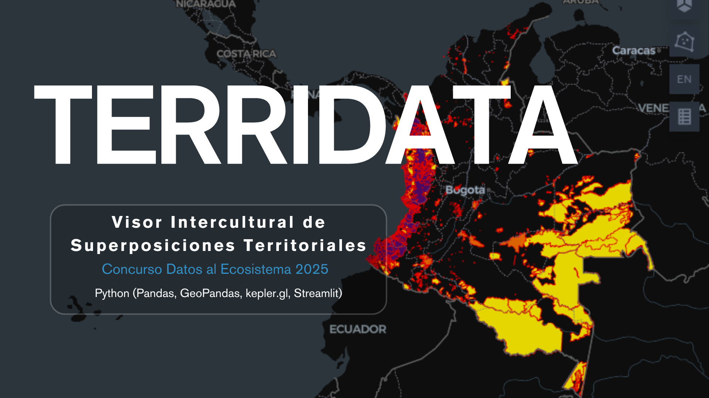

# TERRIDATA – Visor intercultural de superposiciones territoriales




**Integrantes:**  
- Melissa Andrea López Díaz  
- Luis Ángel Herrera Mantilla  
- Alexis de Jesús Ahumada Piñeres

**Documentación técnica:** [TERRIDATA - Documentacion tecnica](./recursos/TERRIDATA_Documentacion_tecnica.pdf)

---

## 📌 Descripción del Proyecto

TERRIDATA es un **dashboard interactivo** que permite visualizar y analizar los **territorios colectivos en Colombia**, incluyendo:  

- Zonas de Reserva Campesina (ZRC)  
- Resguardos Indígenas  
- Consejos Comunitarios de Comunidades Negras  

El dashboard ofrece análisis de **extensión territorial**, **ranking departamental** y **superposición de figuras territoriales**, integrando datos de diversas fuentes oficiales.

---

## 🗂 Fuentes de Datos

1. **Datos geográficos:**
   - Consejos Comunitarios: [GeoJSON ArcGIS](https://utility.arcgis.com/usrsvcs/servers/abf2f9f6727b4073902c1f57c280d5dc/rest/services/DatosAbiertos/Consejo_Comunitario_Titulado/FeatureServer/0/query?outFields=*&where=1%3D1&f=geojson)
   - Zonas de Reserva Campesina: [GeoJSON ArcGIS](https://utility.arcgis.com/usrsvcs/servers/0eca5beb8afe43708622fdd7646cd577/rest/services/DatosAbiertos/Zonas_de_Reserva_Campesina_Constituida/FeatureServer/0/query?outFields=*&where=1%3D1&f=geojson)
   - Resguardos Indígenas: archivo local [Resguardo_Indigena_Formalizado.geojson](./Resguardo_Indigena_Formalizado.geojson)

2. **Datos de departamentos (DIVIPOLA):**
   - Obtenidos mediante [**Socrata API**](https://www.datos.gov.co/api/v3/views/vcjz-niiq/query.json) con `APP_TOKEN` seguro en archivo `.env`

---

## ⚙️ Funcionalidades

- Carga y limpieza de datos geoespaciales  
- Integración de datos de múltiples fuentes  
- Normalización y cálculo de área territorial (ha)  
- Reemplazo de códigos de departamentos por nombres  
- Identificación de **superposiciones territoriales**  
- Visualización interactiva mediante **Kepler.gl + Streamlit**  
- Estadísticas descriptivas y ranking departamental

---

## 🛠 Instalación

1. Clonar el repositorio:

```bash
git clone https://github.com/Lmanti/terri-data.git
cd terri-data
```

2. Crear entorno virtual e instalar dependencias:
```bash
python -m venv myenv
source myenv/bin/activate  # Linux / Mac
myenv\Scripts\activate     # Windows

pip install -r requirements.txt
```

3. Configurar `.env` con tu `APP_TOKEN`:
```bash
APP_TOKEN=tu_app_token_aqui
```

---

## 🚀 Uso

Ejecutar el dashboard:
```bash
streamlit run main.py
```
Y listo!

---

## 🗂 Estructura del Proyecto
```bash
TERRIDATA/
├─ main.py                 # Dashboard principal
├─ constantes.py           # Constantes y URLs de datos
├─ funciones_gdf.py        # Funciones de limpieza y manipulación de GeoDataFrames
├─ funciones_analisis.py   # Funciones de análisis y resumen
├─ funciones_sodapy.py     # Funciones para obtener datos de Socrata API
├─ Resguardo_Indigena_Formalizado.geojson  # Archivo local de resguardos
├─ requirements.txt        # Dependencias del proyecto
├─ .env                    # Archivo con APP_TOKEN (no subir a repo)
├─ README.md
└─ recursos                # Carpeta de la documentación y portada
      ├─ TERRIDATA_Documentacion_tecnica.pdf  # Documentación técnica
      └─ terridata_portada.png                # Portada del proyecto
```

---

## 📊 Visualización
- Mapas interactivos usando Kepler.gl
- Estadísticas resumidas en métricas y tablas
- Identificación de zonas con presencia simultánea (superposiciones) de figuras territoriales

---

## ⚖️ Licencia
Este proyecto es open-source, puedes usarlo y adaptarlo bajo [Apache 2.0 License](https://www.apache.org/licenses/LICENSE-2.0).